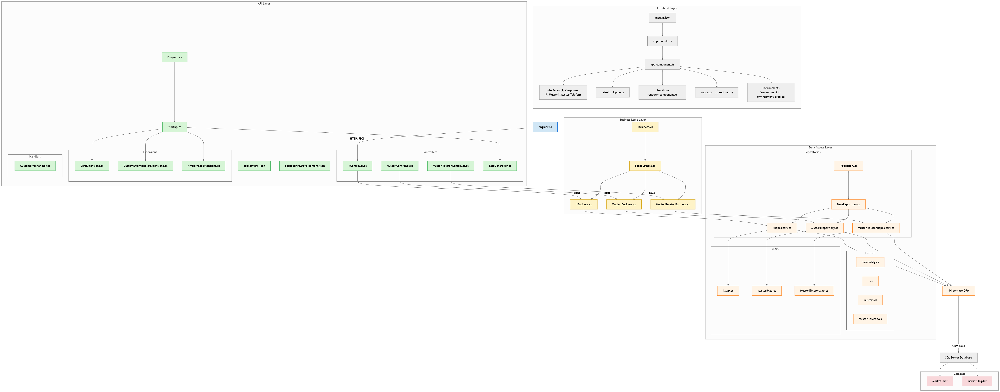

# Market 🛒

[](https://deepwiki.com/ahmadmdabit/market)
[](https://dotnet.microsoft.com/)
[](https://angular.io/)
[](LICENSE.md)

## 📋 Table of Contents
- [Overview](#overview)
- [Architecture](#architecture)
- [Features](#features)
- [Diagram](#diagram)
- [Tech Stack](#tech-stack)
- [Getting Started](#getting-started)
  - [Prerequisites](#prerequisites)
  - [Installation](#installation)
  - [Running the Application](#running-the-application)
  - [Database Setup](#database-setup)
- [Project Structure](#project-structure)
- [API Documentation](#api-documentation)
- [License](#license)

## 📖 Overview

Market is a full-featured customer management application built with modern .NET and Angular technologies. It follows an N-Tier architecture pattern with a clean separation of concerns, making it highly maintainable and scalable.

The application consists of two main components:
- **Backend API**: A RESTful web API with Swagger documentation
- **Frontend UI**: An Angular 11 application for the user interface

## 🏗️ Architecture

The application follows a traditional N-Tier architecture pattern:

```
UI (Frontend) ←→ API (Backend) ←→ BLL ←→ DAL ←→ Database
```

### Layers:
1. **DAL (Data Access Layer)**: Database operations using NHibernate ORM
2. **BLL (Business Logic Layer)**: Business logic implementation
3. **API (Backend)**: RESTful API with Swagger documentation
4. **UI (Frontend)**: Angular 11 application for the user interface

## ✨ Features

- 📋 **Customer Management**: Create, read, update, and delete customer information
- 📍 **City/Province Management**: Manage city/province information with geographic coordinates
- 📞 **Phone Management**: Track multiple phone numbers per customer
- 📊 **Data Grid**: Interactive data tables with sorting, filtering, and pagination
- 🎨 **Responsive Design**: Mobile-friendly interface using Bootstrap
- 📚 **API Documentation**: Interactive Swagger UI
- 🔄 **CRUD Operations**: Complete create, read, update, and delete functionality

## 📊 Diagram

[](https://gitdiagram.com/ahmadmdabit/market)



## 🧰 Tech Stack

| Layer | Technology |
|-------|------------|
| **Backend Framework** | ASP.NET Core 3.1 |
| **Frontend Framework** | Angular 11 |
| **Language** | C#, TypeScript |
| **Architecture** | N-Tier |
| **Database** | SQL Server LocalDB (NHibernate ORM) |
| **UI Library** | Bootstrap 4.5, ag-Grid |
| **API Documentation** | Swagger/OpenAPI |

## 🚀 Getting Started

### Prerequisites

- [.NET Core 3.1 SDK](https://dotnet.microsoft.com/download/dotnet/3.1)
- [Node.js 14.x or later](https://nodejs.org/)
- SQL Server LocalDB (included with Visual Studio or [SQL Server Express](https://www.microsoft.com/en-us/sql-server/sql-server-downloads))

### Installation

1. Clone the repository:
   ```bash
   git clone https://github.com/ahmadmdabit/market.git
   cd market
   ```

2. Restore backend dependencies:
   ```bash
   cd API
   dotnet restore
   ```

3. Install frontend dependencies:
   ```bash
   cd ../ui
   npm install
   ```

### Running the Application

#### Backend API
```bash
cd API
dotnet run
```
- **API Endpoint**: `https://localhost:44374`
- **Swagger UI**: Available at `/swagger`

#### Frontend UI
```bash
cd ui
npm start
```
- **Web Interface**: `http://localhost:4200`

### Database Setup

The application uses SQL Server LocalDB with an attached MDF file:

- **Database file**: `API/App_Data/Market.mdf`
- **Connection string**: `Data Source=(LocalDB)\\MSSQLLocalDB;AttachDbFilename=|DataDirectory|\\Market.mdf;Integrated Security=True;Connect Timeout=30`

The database will be automatically created when the application runs for the first time.

## 📁 Project Structure

```
market\
├── API\           # RESTful API backend
├── BLL\           # Business Logic Layer
├── DAL\           # Data Access Layer
└── ui\            # Angular frontend
```

## 📚 API Documentation

The API is documented using Swagger/OpenAPI. Once the API is running, you can access the interactive documentation at:

```
https://localhost:44374/swagger
```

The documentation provides:
- Complete endpoint list for all entities (Il, Musteri, MusteriTelefon)
- Request/response schemas
- Interactive testing interface

## 📄 License

Licensed under the [MIT license](LICENSE.md).